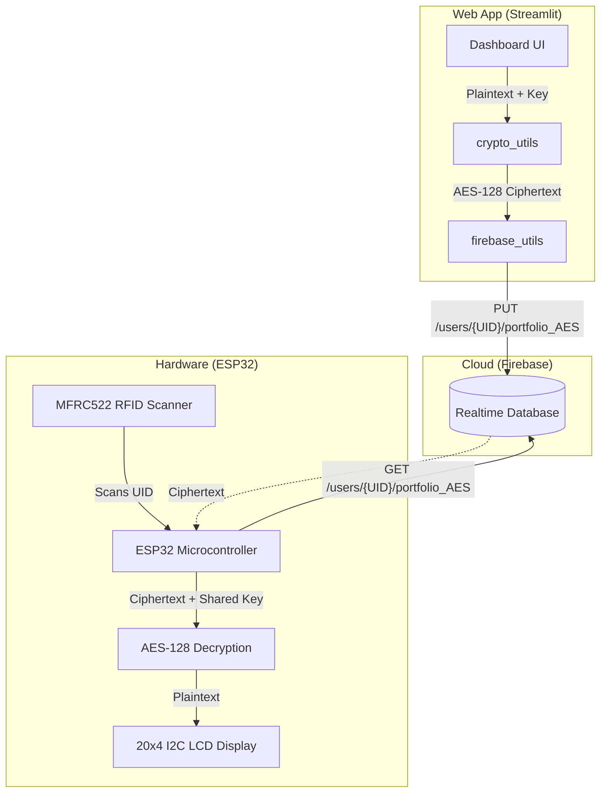

# 🔐 Real-Time Secure Dashboard with RFID-Based Portfolio & Price Alerts

An IoT + Cybersecurity academic project demonstrating **AES-128 encryption**, **RFID-based authentication**, and **real-time data monitoring** using **ESP32**, **Streamlit**, and **Firebase Realtime Database**.

---

## 📋 Project Overview

This system is a two-sided secure dashboard:

| Side | Technology | Purpose |
|------|-----------|---------|
| **Web App** | Python / Streamlit | Portfolio input → AES encrypt → Firebase storage + public data dashboard |
| **Hardware** | ESP32 + MFRC522 RFID | RFID scan → Firebase fetch → AES decrypt → LCD display + price alerts |

### Key Features
- 🌦️ **Real-time public data**: Weather, stock prices, global time zones
- 🔐 **AES-128 encryption**: Portfolio data encrypted before cloud storage
- 🏷️ **RFID authentication**: Only authorized users can view their portfolio on the ESP32
- 📊 **AES vs DES benchmarking**: Performance comparison with visualization
- 🔥 **Firebase Realtime Database**: Cloud storage for encrypted portfolio data
- 🚨 **Price alerts**: LED/buzzer notifications for significant price changes (ESP32)

---

## 🏗️ Architecture



### 📸 Dashboard Features & Security Analysis

The Streamlit dashboard allows managing public data and running advanced cryptographic analyses:


---

## 🚀 Quick Start (Web App)

### Prerequisites
- Python 3.9+
- OpenWeatherMap API key ([get one free](https://openweathermap.org/api))

### Setup

```bash
# 1. Clone the repository
git clone https://github.com/akshat333-debug/BharatFi2.git
cd BharatFi2

# 2. Create virtual environment
python -m venv venv
source venv/bin/activate   # macOS/Linux
# venv\Scripts\activate    # Windows

# 3. Install dependencies
pip install -r requirements.txt

# 4. Configure environment
cp .env.example .env
# Edit .env and add your WEATHER_API_KEY

# 5. Run the dashboard
streamlit run main_dashboard.py
```

---

## 📁 Project Structure

```
Project-PoCS-Final-main/
├── config.py                    # Centralized configuration (Firebase URL, constants)
├── utils/
│   ├── __init__.py
│   ├── crypto_utils.py          # Shared AES/DES encrypt/decrypt functions
│   └── firebase_utils.py        # Firebase REST API helper functions
├── main_dashboard.py            # Primary Streamlit dashboard (weather + stocks + crypto)
├── aes_des_dashboard.py         # AES vs DES benchmark visualization dashboard
├── crypto_firebase.py           # CLI: AES/DES encrypt → Firebase write/read
├── crypto_firebase_benchmark.py # CLI: Benchmark 1000 AES/DES cycles → Firebase
├── aes_des_test.py              # CLI: Standalone AES/DES encrypt/decrypt test
├── firebase_test.py             # CLI: Basic Firebase connectivity test
├── POC_Database.json            # Sample Firebase schema / seed data
├── requirements.txt             # Python dependencies
├── .env.example                 # Environment variable template
└── .gitignore                   # Git ignore rules
```

---

## 🔐 Security Model

| Layer | Mechanism | Details |
|-------|-----------|---------|
| **Encryption** | AES-128-ECB | Symmetric key shared between Streamlit and ESP32 |
| **Authentication** | RFID UID | Only registered RFID tags can access portfolio data |
| **Transport** | HTTPS | Firebase REST API uses TLS encryption |
| **Storage** | Base64 + AES | Portfolio never stored in plaintext in the cloud |

---

## 🔧 ESP32 Hardware Setup

### Components
- ESP32 DevKit v1
- MFRC522 RFID Reader
- 20x4 LCD (I2C)
- RGB LED + Buzzer (for price alerts)

### Wiring

| LCD 20x4 I2C | ESP32 |
|--------------|-------|
| GND | GND |
| VCC | VIN |
| SDA | D21 |
| SCL | D22 |

| RFID-RC522 | ESP32 |
|------------|-------|
| SDA/SS | D5 |
| SCK | D18 |
| MOSI | D23 |
| MISO | D19 |
| RST | D4 |
| GND | GND |
| 3.3V | 3V3 |

---

## 📚 References

- NIST FIPS 197: Advanced Encryption Standard (AES), 2001
- Ari Juels, *RFID Security and Privacy: A Research Survey*, IEEE, 2006
- Chris Karlof et al., *TinySec: Link Layer Security for WSN*, SenSys, 2004
- Sabrina Sicari et al., *Security, Privacy and Trust in IoT*, Computer Networks, 2015
- ESP32 Datasheet, Espressif Systems
- Firebase Documentation, Google

---

## © 2026 PoCS Project | Principles of Cyber Security
